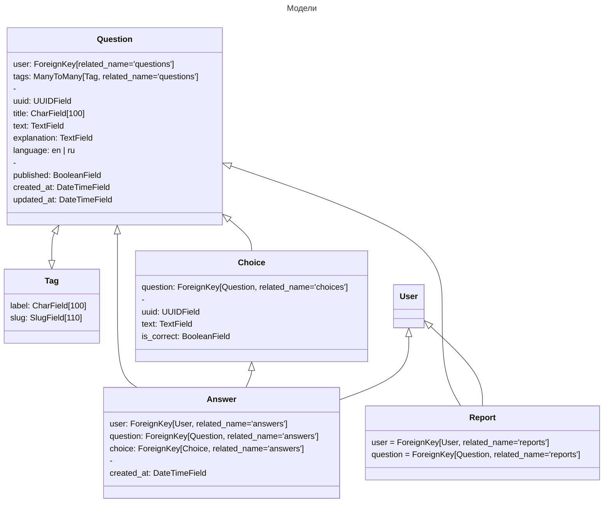

# BrainRefresh

> Our platform offers a unique and interactive way to prepare for technical interviews and refresh forgotten knowledge in web development and Python. With a collection of challenging quizzes and tests, users can assess their skills and identify areas for improvement. Our platform also provides in-depth explanations and resources to help users deepen their understanding and become interview-ready. Whether you're a seasoned developer or just starting out, our platform is the perfect tool to take your skills to the next level.

> Стек: Django 4.1, Vue + Vite, Celery, Docker


## TODO
---

- Апи
    - Шифрование api
    - Implement question daily limit for user creation
    - partial_update для QuestionViewSet
    - Добавление модели Quiz с ManyToMany к Question

## Идеи

---

1. Главная страница
    - интерактив - 3d фигура где каждая часть это навигация (login/reg/questions/tags)
2. Модели
    1. Question
        - User может создавать Question
    2. Tag
        - ManyToMany к Question
        - Поиск, сортировка по тэгам
    3. Choice
        - Ответы на вопрос Question
    4. Answer
        - Ответ пользователя
    5. Report
        - Борьба с ошибками контента и устареванием
3. User
    - Личная страница
    - История прохождения тестов со статусом
    - Возможность создавать Question
    - Награды (карма, титул)
    - Сохранение понравившихся вопросов
        - Формировать подходящие предложения на основе предпочтений
    - Статистика и анализ ошибок пользователя в бизнес плане
4. Questions
    - Возможность выполнять отдельные задания, а также связанные с quiz
    - система лайков - динамичные евенты, подобие как в тик-токе
    - Сбор статистики ответов, ошибок
    - Показать глобальный процент ответов
    - Вопросы в разнобой
    - Режим "на время"
    - Режим "мне повезет"
5. Quiz
    - Отдельная структура
    - Формирование узконаправленных тестов
    - Использование компаниями для тестирования сотрудников
5. Cистема User Ranking
6. Мобильное приложение


## Архитектура

---



## Frontend

---

### Особенности

- Реализован при помощи Vite + Vue (Pseudo-decoupled)
- Возможность загрузки vue из django
    - Подробнее в `frontend/vite.config.js`
    - Билд/Перезагрузка статики на лету в `brainrefresh/static`
    - Разделение .html файлов
        - Frontend для локальной разработки (необязательно)
        - Backend для продакшена
- Минусы:
    - Отсутствие хэша у static файлов
    - Конфликты между статикой бэка и фронта при билде
    - Возможная путаница при 2+ разработчиков

### Команды

    # В руте
    npm install

    # Frontend разработка
    npm run dev

    # Backend разработка (build watch)
    npm run build-w


## Tests

---

### Type checks

Running type checks with mypy:

    $ mypy brainrefresh

### Test coverage

To run the tests, check your test coverage, and generate an HTML coverage report:

    $ coverage run -m pytest
    $ coverage html
    $ open htmlcov/index.html

#### Running tests with pytest

    $ pytest

### Live reloading and Sass CSS compilation

Moved to [Live reloading and SASS compilation](https://cookiecutter-django.readthedocs.io/en/latest/developing-locally.html#sass-compilation-live-reloading).

### Celery

This app comes with Celery.

To run a celery worker:

``` bash
cd brainrefresh
celery -A config.celery_app worker -l info
```

Please note: For Celery's import magic to work, it is important *where* the celery commands are run. If you are in the same folder with *manage.py*, you should be right.

### Email Server

[MailHog](https://github.com/mailhog/MailHog) running, to view messages that are sent by your application, open your browser and go to `http://127.0.0.1:8025`

## Deployment

---

The following details how to deploy this application.

### Docker

See detailed [cookiecutter-django Docker documentation](http://cookiecutter-django.readthedocs.io/en/latest/deployment-with-docker.html).

## Версии

---

### 0.4.0 - (08.02.2023)

- Покрытие тестами всех моделей
- Модель Answer + API
- Frontend компоненты Question, QuestionList
- Frontend роутинг

### 0.2.0 - (02.02.2023)

- Модели для Question, Choice, Tag
- API для Question, Choice, Tag
- Frontend билд-система (Vite + Vue)


### 0.1.0 - (31.01.2023)

- Инициализация проекта
